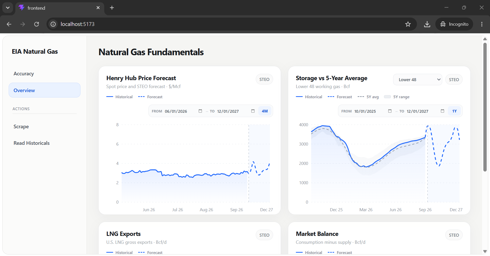
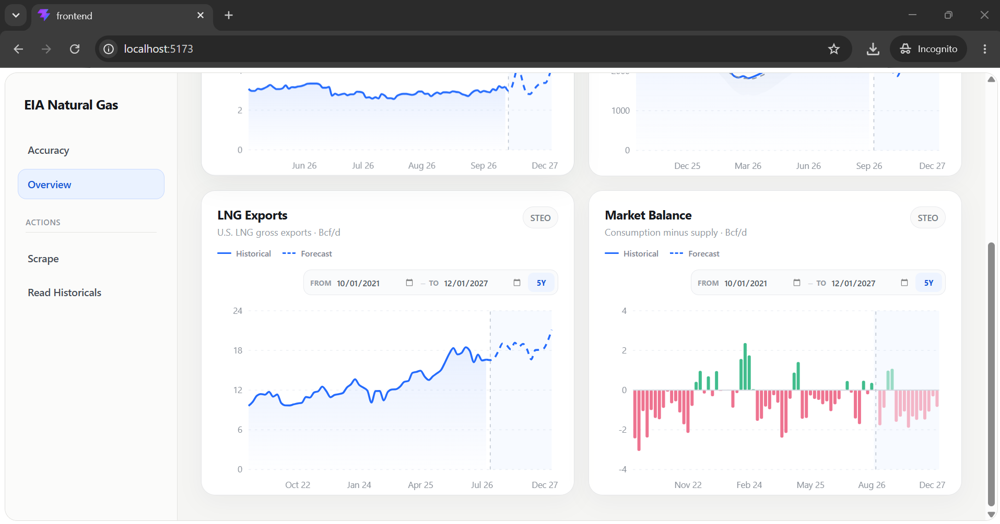

# EIA Energy Dashboard

A dashboard for scraping EIA Short-Term Energy Outlook (STEO) data and
tracking natural gas market data and forecast accuracy over time.




## Setup

### 1. Backend (Python)

Create a virtual environment and install dependencies:

```
python -m venv .venv
.venv\Scripts\activate
pip install -r requirements.txt
```

### 2. Create the `data` folder

The backend stores its DuckDB database file here. Create it at the project
root if it doesn't already exist:

```
mkdir data
```

### 3. Create a `.env` file

In the project root, create a file named `.env` with your EIA API key:

```
EIA_API_KEY=your_api_key_here
```

You can request a free API key at https://www.eia.gov/opendata/register.php

### 4. Frontend (Node.js)

Install the frontend packages:

```
cd frontend
npm install
```

## Running the app

From the project root:

```
cd frontend
npm run dev
```

This starts both the backend (FastAPI/Uvicorn) and frontend (Vite) dev
servers together. The dashboard will be available at http://localhost:5173.
